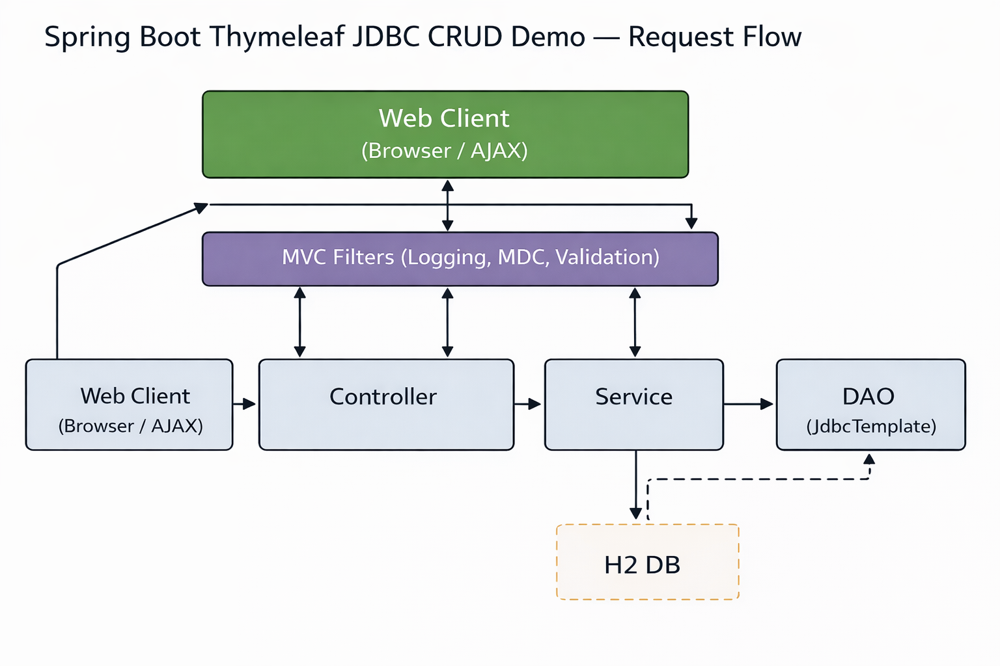
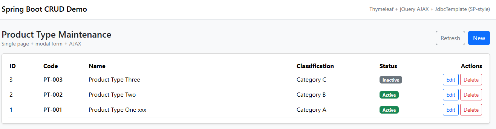
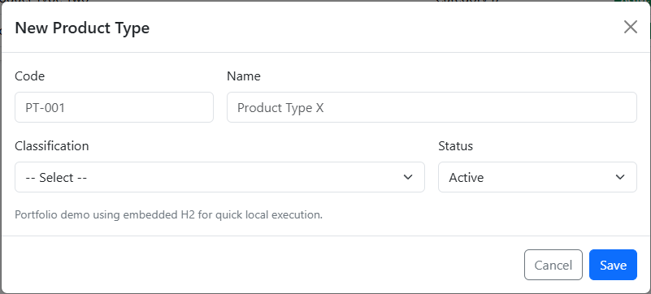
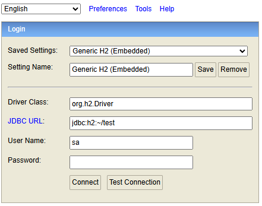

# Spring Boot Thymeleaf JDBC CRUD Demo (Product Type)

[](https://github.com/victor-bendezu/springboot-thymeleaf-jdbc-crud-demo/actions/workflows/ci.yml)
[](https://springboot-thymeleaf-jdbc-crud-demo.onrender.com/product-type)

A portfolio MVC web application demonstrating practical Spring Boot
fundamentals including layered architecture, server-side rendering with
Thymeleaf, validation handling, structured logging, automated testing,
and cloud deployment.

This project showcases practical engineering skills applied to a
traditional server-side rendered web application, focusing on clean
layering (Controller → Service → DAO), maintainability, consistency, and
industry-aligned best practices suitable for a portfolio demo.

------------------------------------------------------------------------

## 🎯 Purpose

This project is part of my portfolio to demonstrate practical Spring
Boot development skills using the MVC pattern, structured layering,
validation fundamentals, automated testing, CI/CD integration, and clean
architecture principles applied to a server-rendered web application.

------------------------------------------------------------------------

## 🔧 Tech Stack

-   Java 17
-   Spring Boot 3
-   Thymeleaf (server-side rendering)
-   JdbcTemplate (DAO layer)
-   H2 (in-memory database)
-   Log4j2 (structured logging)
-   JUnit 5
-   MockMvc
-   Maven (wrapper included)
-   Docker (multi-stage build)
-   GitHub Actions (CI pipeline)
-   Render (cloud deployment)

------------------------------------------------------------------------

## 🌍 Live Demo (Cloud Deployment)

Application:
https://springboot-thymeleaf-jdbc-crud-demo.onrender.com/product-type

Note: Free instances spin down after inactivity, so the first request
may take a few seconds to respond.

------------------------------------------------------------------------

## 🏗 Architecture

Layered design:

Controller → Service → DAO → Database

Key features:

-   DTO validation (`@Valid`)
-   Global exception handling (`@ControllerAdvice`)
-   Consistent JSON response wrapper for AJAX interactions
-   Structured logging with Log4j2
-   Request correlation via MDC filter
-   Clear separation of responsibilities



------------------------------------------------------------------------

## 📦 Public Endpoints

-   GET `/product-type`
-   POST `/product-type`
-   PUT `/product-type/{id}`
-   DELETE `/product-type/{id}`
-   `/h2-console`

Note: The demo uses an in-memory H2 database. Data resets when the
application restarts.

------------------------------------------------------------------------

## 🚀 Quick Start (Local)

Requirements:

-   Java 17
-   Maven 3.9+ (or use included Maven Wrapper)

Run:

`mvn clean spring-boot:run`

or

`./mvnw clean spring-boot:run`

App runs at:

http://localhost:8080/product-type

------------------------------------------------------------------------

## ⚡ Quick Start (Docker)

`docker build -t thymeleaf-crud-demo .`

`docker run -p 8080:8080 thymeleaf-crud-demo`

------------------------------------------------------------------------

## 🧪 Testing

Controller tests are included using Spring Boot Test and MockMvc.

Validated areas:

-   Validation error responses
-   Successful CRUD behavior
-   Standardized response structure

Run tests:

`mvn test`

or

`./mvnw clean verify`

Tests execute automatically via GitHub Actions on every push.

------------------------------------------------------------------------

## 🛠 Deployment Overview

The project is containerized using a multi-stage Docker build:

-   Maven build stage
-   Lightweight JRE runtime stage
-   Environment-based port configuration (`server.port=${PORT:8080}`)
-   HTTPS termination handled by Render
-   CI validates builds and tests on every push

In production, H2 would be replaced by a persistent database
(PostgreSQL/MySQL) with externalized configuration.

------------------------------------------------------------------------

## 📸 Screenshots

### Main Screen



### Modal Form



### H2 Console



------------------------------------------------------------------------

## 🧠 Design Notes

-   Layered MVC architecture
-   Separation of concerns between view rendering and data access
-   Structured exception handling
-   Log correlation via MDC
-   Consistent response contracts for AJAX operations
-   Basic automated controller testing
-   Clean and maintainable package organization

------------------------------------------------------------------------

## 🧩 Project Structure

```text
springboot-thymeleaf-jdbc-crud-demo
├── src
│   ├── main
│   │   ├── java/com/victor/portfolio
│   │   │   ├── common
│   │   │   ├── db
│   │   │   ├── product
│   │   │   └── PortfolioCrudDemoApplication.java
│   │   └── resources
│   │       ├── static
│   │       ├── templates
│   │       ├── application.properties
│   │       ├── schema.sql
│   │       ├── data.sql
│   │       └── log4j2-spring.xml
│   └── test
├── Dockerfile
├── mvnw
├── mvnw.cmd
└── pom.xml
```

This structure keeps responsibilities separated by feature (`product`)
and by layer (controller/service/dao), making the project easier to
navigate and maintain.

------------------------------------------------------------------------

## ⚙ Environment Configuration

Configuration is handled through:

application.properties

The server port is configurable via:

`server.port=\${PORT:8080}`

This enables flexible local and cloud deployment configuration.

------------------------------------------------------------------------